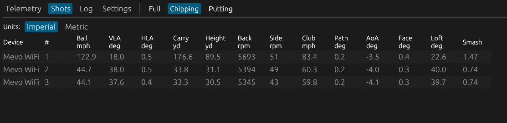
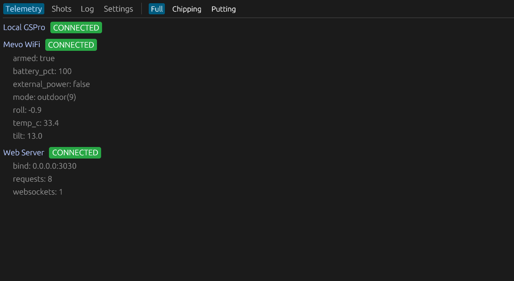
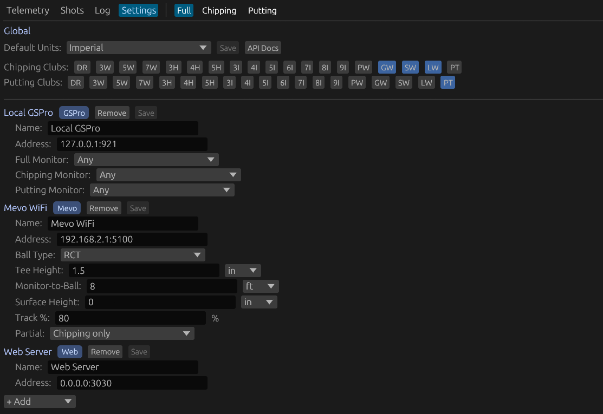
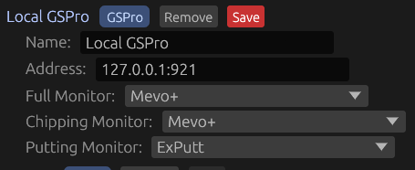

# flighthook

Acts as a bridge between golf launch monitors and simulation software.
Connects to launch monitors, decodes shot data, and forwards it to integrations like GSPro.
Provides a REST and WebSocket API for custom integrations to participate on the central event bus.

## Status

**Alpha (0.0.x)** — This project is in early development. The API, configuration format, and internal interfaces may change at any time. No semver compatibility guarantees are provided until a stable 1.0 release.

## Features

- Multi-device support
- Automatic detection mode switching based on club selection (full / chipping / putting)
- Dual UI: native desktop window (eframe/egui) and browser dashboard (WASM, same codebase)
- Configurable via TOML file with live settings updates
- REST + WebSocket API for external consumers — subscribe to shot data, device telemetry, and raw audit events in real time. Build custom shot triggers, data loggers, or alternative integrations without touching the core.

### Shot Tracking



### Monitoring



### Centralized Configuration



### Multi-Monitor Routing



## Architecture

A single `broadcast<FlighthookMessage>` bus connects all components.
Each message carries a UTC timestamp, a typed event, and an optional raw payload (for debugging).
Session threads, integration bridges, and the web layer all subscribe to the same bus.
This allows for third party software can connect with a websocket and interact with the bus the same way as any built-in native integration.

## Configuration

Settings can be configured from the UI or file.

TOML file auto-created on first run at the platform config directory:

- **Linux**: `~/.config/flighthook/config.toml`
- **Windows**: `%APPDATA%\flighthook\config.toml`
- **macOS**: `~/Library/Application Support/flighthook/config.toml`

```toml
[webserver.0]
name = "Web Server"
bind = "0.0.0.0:3030"

[mevo.0]
name = "My Mevo+"
address = "192.168.2.1:5100"
ball_type = 0                  # 0 = RCT, 1 = Standard
tee_height = "1.5in"
range = "8ft"
surface_height = "0in"
track_pct = 80.0
use_partial = "chipping_only"  # never | chipping_only | always

[gspro.0]
name = "Local GSPro"
address = "127.0.0.1:921"
```

Section prefixes encode component type: `mevo`, `mock_monitor`, `gspro`,
`random_club`. The index after the dot (`0`, `1`, ...) identifies the
instance. Settings can also be edited live from the Settings tab in the UI.

## Developer Quick Start

### Prerequisites

- Rust toolchain
- [Trunk](https://trunkrs.dev/) (for WASM UI build)
- `wasm32-unknown-unknown` target (`rustup target add wasm32-unknown-unknown`)
- For Windows cross-compile: `mingw-w64` (`sudo apt install mingw-w64`)

### Build and Run

```bash
# Build everything (UI WASM + native binary)
make build

# Run with ~/.config/flighthook/config.toml
make run

# Run with a specific config
make run config=mock.toml

# Headless (web dashboard only, no native window)
make run headless=true
```

### Cross-Compile and Deploy to Windows

```bash
make deploy host=golfpc dir=Documents
```

### CLI

```
flighthook [--config PATH] [--headless]
```

| Flag         | Default                         | Description                          |
| ------------ | ------------------------------- | ------------------------------------ |
| `--config`   | platform config dir (see below) | Config file path                     |
| `--headless` | off                             | Web dashboard only, no native window |

To run with a mock device, point `--config` at a TOML file with
`[mock_monitor.0]` sections instead of `[mevo.0]`.

## Developer Documentation

- **[docs/ARCHITECTURE.md](docs/ARCHITECTURE.md)** — Multi-device config model,
  unified bus, threading, state machine, settings UI design.
- **[docs/API.md](docs/API.md)** — REST and WebSocket API reference for the web
  dashboard (`/api/status`, `/api/shots`, `/api/ws`, etc.).

---

Mevo+ and FlightScope are trademarks of FlightScope (Pty) Ltd. ExPutt is a trademark of ExPutt Inc. GSPro is a trademark of GSPro LLC. flighthook is not affiliated with, endorsed by, or sponsored by any of these companies.
