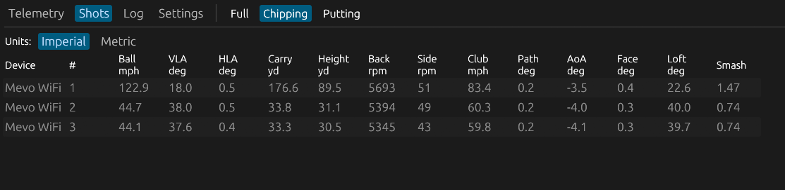
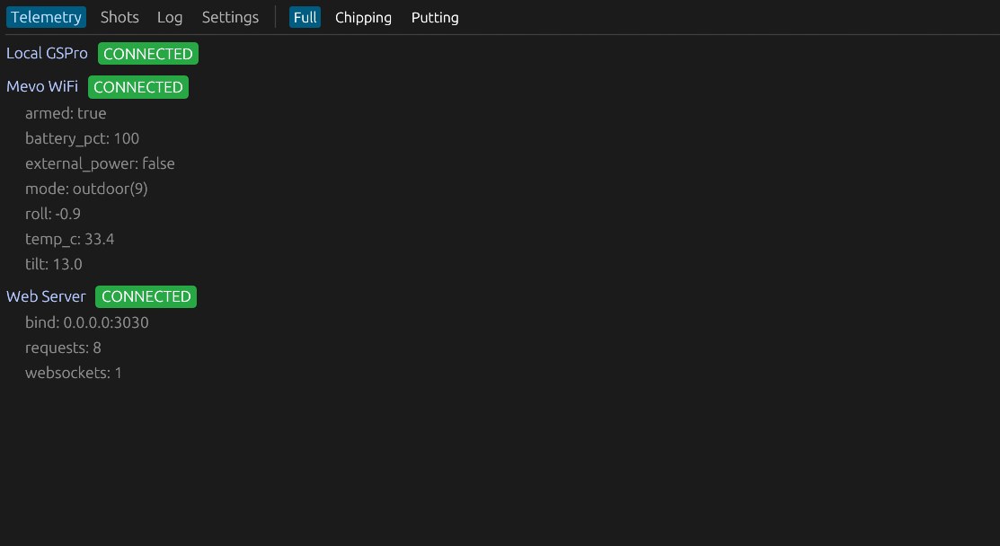
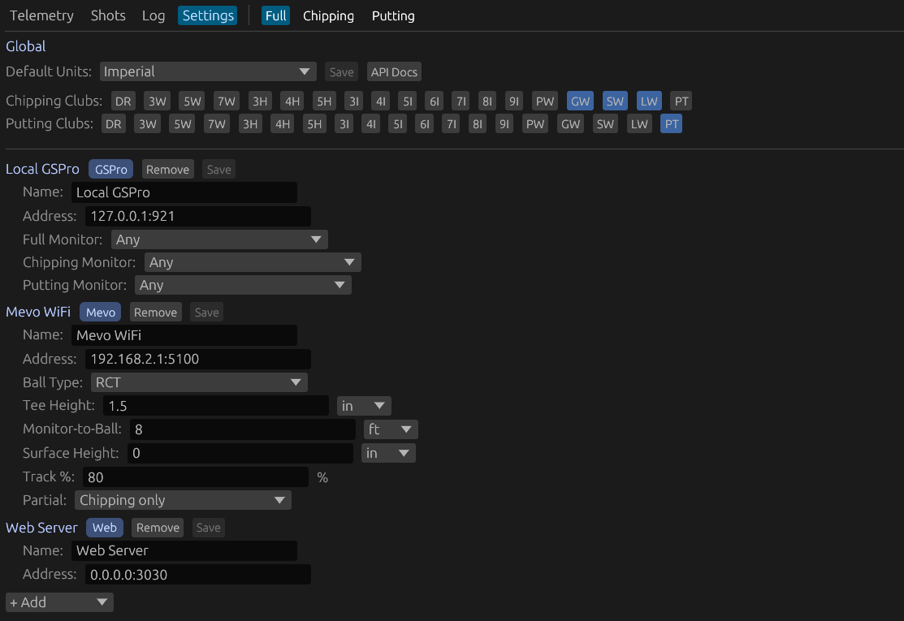
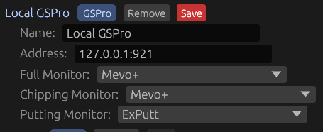

# flighthook

[](https://github.com/divotmaker/flighthook/actions/workflows/ci.yml)
[](https://crates.io/crates/flighthook)
[](https://docs.rs/flighthook)

Acts as a bridge between golf launch monitors and simulation software.
Connects to launch monitors, decodes shot data, and forwards it to integrations like GSPro.
Provides a REST and WebSocket API for custom integrations to participate on the central event bus.

## Supported Integrations

### Launch Monitors

Each device links to its setup notes, quirks, and config reference.

| Device                                               | Protocol                | Driver                                          | Status           |
| ---------------------------------------------------- | ----------------------- | ----------------------------------------------- | ---------------- |
| [FlightScope Mevo+](docs/devices/flightscope.md)     | TCP (binary, port 5100) | [ironsight](https://crates.io/crates/ironsight) | Supported        |
| [FlightScope Mevo Gen2](docs/devices/flightscope.md) | TCP (binary, port 5100) | [ironsight](https://crates.io/crates/ironsight) | Supported        |
| [Square Golf Omni](docs/devices/square-golf.md)      | BLE (GATT)              | [allsquare](https://crates.io/crates/allsquare) | Beta             |
| [Garmin R10](docs/devices/garmin-r10.md)             | BLE / GFDI / Protobuf   | [tenover](https://crates.io/crates/tenover)     | Alpha            |
| [Uneekor](docs/devices/uneekor.md)                   | TCP (JSON, port 921)    | built-in (OpenConnect)                          | Alpha (untested) |

Uneekor connects through the **OpenConnect server** actor, which accepts shots
from any launch monitor that speaks GSPro Open Connect as a client — Foresight,
SkyTrak and MLM2PRO also emit it.

### Simulation Software

| Software | Protocol             | Status    |
| -------- | -------------------- | --------- |
| GSPro    | TCP (JSON, port 921) | Supported |

### Custom Integrations

flighthook exposes a REST + WebSocket API on the event bus, so any external software can subscribe to shot data, device telemetry, and raw audit events. See [docs/API.md](docs/API.md).

#### Flight Relay Protocol

The WebSocket API speaks the [Flight Relay Protocol](https://github.com/flightrelay/spec)
(FRP) — an open, vendor-neutral protocol for launch monitor shot data. flighthook
serves it at `ws://<host>:5880/frp` and negotiates the spec version on connect,
currently `0.1.0`.

Whatever the monitor is — a Mevo+ over its binary TCP protocol, an R10 over BLE,
a Uneekor over OpenConnect — it is normalised into the same FRP event stream, so
a consumer is written once rather than per device.

The shot lifecycle events (`shot_trigger`, `ball_flight`, `club_path`,
`face_impact`, `shot_finished`) and the device events (`device_telemetry`,
`alert`) are FRP-compliant and use the spec's own field shapes; the types come
from the [`flightrelay`](https://crates.io/crates/flightrelay) crate. flighthook
adds its own event kinds alongside them (player/club info, config commands, actor
status), which FRP-only consumers ignore per spec.

The spec is CC0 and the Rust SDK is Apache-2.0/MIT, so consumers need not depend
on flighthook itself.

## Status

**Beta (0.1.x)** — The API, configuration format, and WebSocket protocol are usable but may still change. Breaking changes will be noted in release notes.

## Features

- Multi-device support
- Automatic detection mode switching based on club selection (full / chipping / putting)
- Club selection is forwarded to devices that use it — the Square Golf Omni has no
  separate putting mode, so selecting a putter in the sim puts it in putting mode
- Dual UI: native desktop window (eframe/egui) and browser dashboard (WASM, same codebase)
- Configurable via TOML file with live settings updates
- REST + WebSocket API for external consumers — subscribe to shot data, device telemetry, and raw audit events in real time. Build custom shot triggers, data loggers, or alternative integrations without touching the core.

### Shot Tracking



### Monitoring



### Centralized Configuration



### Multi-Monitor Routing



## Architecture

A single `broadcast<FlighthookMessage>` bus connects all components.
Each message carries a typed event and an optional raw payload (for debugging).
Session threads, integration bridges, and the web layer all subscribe to the same bus.
Third-party software can connect via WebSocket and interact with the bus the same way as any built-in integration.

## Configuration

Settings can be configured from the UI or file.

TOML file auto-created on first run at the platform config directory:

- **Linux**: `~/.config/flighthook/config.toml`
- **Windows**: `%APPDATA%\flighthook\config.toml`
- **macOS**: `~/Library/Application Support/flighthook/config.toml`

```toml
[webserver.0]
name = "Web Server"
bind = "0.0.0.0:5880"

[mevo.0]
name = "My Mevo+"
address = "192.168.2.1:5100"
ball_type = 0                  # 0 = RCT, 1 = Standard
tee_height = "1.5in"
range = "8ft"
surface_height = "0in"
track_pct = 80.0

[square.0]
name = "Square Golf Omni"
# address is optional — omit it to auto-discover by name. No pairing required.
address = "DC:0D:30:62:54:E4"
club = "7i"                    # club selected on connect
advanced_spin = true           # device's advanced spin measurement
discard_non_putting_zero_spin = true   # drop 0-spin misreads (putts exempt)

[r10.0]
name = "Garmin R10"

[gspro.0]
name = "Local GSPro"
address = "127.0.0.1:921"
```

Section prefixes encode component type: `webserver`, `mevo`, `r10`, `square`,
`openconnect_server`, `mock_monitor`, `gspro`, `random_club`. The index after
the dot (`0`, `1`, ...) identifies the instance. Per-device options are covered
in the [device docs](#launch-monitors). Settings can also be edited live from
the Settings tab in the UI.

## Developer Quick Start

### Prerequisites

- Rust toolchain
- [Trunk](https://trunkrs.dev/) (for WASM UI build)
- `wasm32-unknown-unknown` target (`rustup target add wasm32-unknown-unknown`)
- For Windows cross-compile: `mingw-w64` (`sudo apt install mingw-w64`)

### Build and Run

```bash
# Build everything (UI WASM + native binary)
make build

# Run with ~/.config/flighthook/config.toml
make run

# Run with a specific config
make run config=mock.toml

# Headless (web dashboard only, no native window)
make run headless=true
```

### Cross-Compile and Deploy to Windows

```bash
make deploy host=golfpc dir=Documents
```

### CLI

```
flighthook [--config PATH] [--headless]
```

| Flag         | Default                         | Description                          |
| ------------ | ------------------------------- | ------------------------------------ |
| `--config`   | platform config dir (see above) | Config file path                     |
| `--headless` | off                             | Web dashboard only, no native window |

To run with a mock device, point `--config` at a TOML file with
`[mock_monitor.0]` sections instead of `[mevo.0]`.

## Developer Documentation

- **[docs/ARCHITECTURE.md](docs/ARCHITECTURE.md)** — Multi-device config model,
  unified bus, threading, state machine, settings UI design.
- **[docs/API.md](docs/API.md)** — REST and WebSocket API reference for the web
  dashboard (`/api/status`, `/api/shots`, `/frp`, etc.).

---

Mevo+ and FlightScope are trademarks of FlightScope (Pty) Ltd. Garmin and Approach R10 are trademarks of Garmin Ltd. or its subsidiaries. ExPutt, Square Golf and Square Omni are trademarks of Invant Inc. Uneekor, EYE MINI, EYE XO and QED are trademarks of Uneekor, Inc. GSPro is a trademark of GSP Golf AB. Foresight Sports, SkyTrak and MLM2PRO are trademarks of their respective owners. flighthook is not affiliated with, endorsed by, or sponsored by any of these companies.
